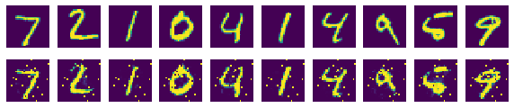

```python
import tensorflow.compat.v1 as tf
tf.disable_v2_behavior()

import matplotlib.pyplot as plt
import numpy as np


from tensorflow.examples.tutorials.mnist import input_data
mnist=input_data.read_data_sets("./mnist/data/",one_hot=True)
```

    WARNING:tensorflow:From c:\users\안지혜\appdata\local\programs\python\python36\lib\site-packages\tensorflow_core\python\compat\v2_compat.py:65: disable_resource_variables (from tensorflow.python.ops.variable_scope) is deprecated and will be removed in a future version.
    Instructions for updating:
    non-resource variables are not supported in the long term
    WARNING:tensorflow:From <ipython-input-1-bec8941499c3>:9: read_data_sets (from tensorflow.examples.tutorials.mnist.input_data) is deprecated and will be removed in a future version.
    Instructions for updating:
    Please use alternatives such as: tensorflow_datasets.load('mnist')
    WARNING:tensorflow:From c:\users\안지혜\appdata\local\programs\python\python36\lib\site-packages\tensorflow_core\examples\tutorials\mnist\input_data.py:297: _maybe_download (from tensorflow.examples.tutorials.mnist.input_data) is deprecated and will be removed in a future version.
    Instructions for updating:
    Please write your own downloading logic.
    WARNING:tensorflow:From c:\users\안지혜\appdata\local\programs\python\python36\lib\site-packages\tensorflow_core\examples\tutorials\mnist\input_data.py:299: _extract_images (from tensorflow.examples.tutorials.mnist.input_data) is deprecated and will be removed in a future version.
    Instructions for updating:
    Please use tf.data to implement this functionality.
    Extracting ./mnist/data/train-images-idx3-ubyte.gz
    WARNING:tensorflow:From c:\users\안지혜\appdata\local\programs\python\python36\lib\site-packages\tensorflow_core\examples\tutorials\mnist\input_data.py:304: _extract_labels (from tensorflow.examples.tutorials.mnist.input_data) is deprecated and will be removed in a future version.
    Instructions for updating:
    Please use tf.data to implement this functionality.
    Extracting ./mnist/data/train-labels-idx1-ubyte.gz
    WARNING:tensorflow:From c:\users\안지혜\appdata\local\programs\python\python36\lib\site-packages\tensorflow_core\examples\tutorials\mnist\input_data.py:112: _dense_to_one_hot (from tensorflow.examples.tutorials.mnist.input_data) is deprecated and will be removed in a future version.
    Instructions for updating:
    Please use tf.one_hot on tensors.
    Extracting ./mnist/data/t10k-images-idx3-ubyte.gz
    Extracting ./mnist/data/t10k-labels-idx1-ubyte.gz
    WARNING:tensorflow:From c:\users\안지혜\appdata\local\programs\python\python36\lib\site-packages\tensorflow_core\examples\tutorials\mnist\input_data.py:328: _DataSet.__init__ (from tensorflow.examples.tutorials.mnist.input_data) is deprecated and will be removed in a future version.
    Instructions for updating:
    Please use alternatives such as official/mnist/_DataSet.py from tensorflow/models.
    


```python
learning_rate=0.01
training_epoch=20
batch_size=100
n_hidden=256
n_input=28*28
```


```python
X=tf.placeholder(tf.float32,[None,n_input])
```


```python
W_encode=tf.Variable(tf.random_normal([n_input,n_hidden]))
b_encode=tf.Variable(tf.random_normal([n_hidden]))
encoder=tf.nn.sigmoid(tf.add(tf.matmul(X,W_encode),b_encode))
```


```python
W_decode=tf.Variable(tf.random_normal([n_hidden,n_input]))
b_decode=tf.Variable(tf.random_normal([n_input]))
decoder=tf.nn.sigmoid(tf.add(tf.matmul(encoder,W_decode),b_decode))
```


```python
cost =tf.reduce_mean(tf.pow(X-decoder,2))
optimizer=tf.train.RMSPropOptimizer(learning_rate).minimize(cost)
```

    WARNING:tensorflow:From c:\users\안지혜\appdata\local\programs\python\python36\lib\site-packages\tensorflow_core\python\training\rmsprop.py:119: calling Ones.__init__ (from tensorflow.python.ops.init_ops) with dtype is deprecated and will be removed in a future version.
    Instructions for updating:
    Call initializer instance with the dtype argument instead of passing it to the constructor
    


```python
init=tf.global_variables_initializer()
sess=tf.Session()
sess.run(init)

total_batch=int(mnist.train.num_examples/batch_size)

for epoch in range(training_epoch):
    total_cost=0
    for i in range(total_batch):
        batch_xs,batch_ys=mnist.train.next_batch(batch_size)
        _,cost_val=sess.run([optimizer,cost],feed_dict={X:batch_xs})
        
        total_cost+=cost_val
        
        
    print('Epoch : ','%04d'%(epoch+1),'Avg. cost=','{:.4f}'.format(total_cost/total_batch))
    
print('최적화 완료!')
```

    Epoch :  0001 Avg. cost= 0.1995
    Epoch :  0002 Avg. cost= 0.0656
    Epoch :  0003 Avg. cost= 0.0544
    Epoch :  0004 Avg. cost= 0.0490
    Epoch :  0005 Avg. cost= 0.0449
    Epoch :  0006 Avg. cost= 0.0419
    Epoch :  0007 Avg. cost= 0.0402
    Epoch :  0008 Avg. cost= 0.0389
    Epoch :  0009 Avg. cost= 0.0379
    Epoch :  0010 Avg. cost= 0.0375
    Epoch :  0011 Avg. cost= 0.0371
    Epoch :  0012 Avg. cost= 0.0369
    Epoch :  0013 Avg. cost= 0.0367
    Epoch :  0014 Avg. cost= 0.0364
    Epoch :  0015 Avg. cost= 0.0360
    Epoch :  0016 Avg. cost= 0.0358
    Epoch :  0017 Avg. cost= 0.0355
    Epoch :  0018 Avg. cost= 0.0342
    Epoch :  0019 Avg. cost= 0.0341
    Epoch :  0020 Avg. cost= 0.0340
    최적화 완료!
    


```python
sample_size=10

samples=sess.run(decoder,feed_dict={X:mnist.test.images[:sample_size]})

fig,ax=plt.subplots(2,sample_size,figsize=(sample_size,2))

for i in range(sample_size):
    ax[0][i].set_axis_off()
    ax[1][i].set_axis_off()
    ax[0][i].imshow(np.reshape(mnist.test.images[i],(28,28)))
    ax[1][i].imshow(np.reshape(samples[i],(28,28)))
    
plt.show()
```





```python

```
