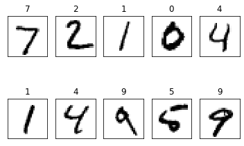

```python
import tensorflow.compat.v1 as tf
tf.disable_v2_behavior()

import matplotlib.pyplot as plt
import numpy as np


from tensorflow.examples.tutorials.mnist import input_data
mnist=input_data.read_data_sets("./mnist/data/",one_hot=True)


```

    Extracting ./mnist/data/train-images-idx3-ubyte.gz
    Extracting ./mnist/data/train-labels-idx1-ubyte.gz
    Extracting ./mnist/data/t10k-images-idx3-ubyte.gz
    Extracting ./mnist/data/t10k-labels-idx1-ubyte.gz
    


```python
X=tf.placeholder(tf.float32,[None,784])
Y=tf.placeholder(tf.float32,[None,10])
```


```python
keep_prob=tf.placeholder(tf.float32)

W1=tf.Variable(tf.random_normal([784,256],stddev=0.01))
L1=tf.nn.relu(tf.matmul(X,W1))
L1=tf.nn.dropout(L1,keep_prob)    

W2=tf.Variable(tf.random_normal([256,256],stddev=0.01))
L2=tf.nn.relu(tf.matmul(L1,W2))
L2=tf.nn.dropout(L2,keep_prob)

W3=tf.Variable(tf.random_normal([256,10],stddev=0.01))
model=tf.matmul(L2,W3)
```


```python
cost=tf.reduce_mean(tf.nn.softmax_cross_entropy_with_logits(logits=model,labels=Y))
optimizer=tf.train.AdamOptimizer(0.001).minimize(cost)
```


```python
init=tf.global_variables_initializer()
sess=tf.Session()
sess.run(init)
```


```python
batch_size=100
total_batch=int(mnist.train.num_examples/batch_size)
```


```python
for epoch in range(30):
    total_cost = 0

    for i in range(total_batch):
        # 텐서플로우의 mnist 모델의 next_batch 함수를 이용해
        # 지정한 크기만큼 학습할 데이터를 가져옵니다.
        batch_xs, batch_ys = mnist.train.next_batch(batch_size)

        _, cost_val = sess.run([optimizer, cost], feed_dict={X: batch_xs, Y: batch_ys,keep_prob:0.8})
        total_cost += cost_val

    print('Epoch:', '%04d' % (epoch + 1),
          'Avg. cost =', '{:.3f}'.format(total_cost / total_batch))

print('최적화 완료!')
    
    
    
    
is_correct=tf.equal(tf.argmax(model,1),tf.argmax(Y,1))
accuracy=tf.reduce_mean(tf.cast(is_correct,tf.float32))
print('정확도:', sess.run(accuracy,
                        feed_dict={X: mnist.test.images,
                                   Y: mnist.test.labels,keep_prob:1}))
```

    Epoch: 0001 Avg. cost = 0.426
    Epoch: 0002 Avg. cost = 0.166
    Epoch: 0003 Avg. cost = 0.116
    Epoch: 0004 Avg. cost = 0.089
    Epoch: 0005 Avg. cost = 0.073
    Epoch: 0006 Avg. cost = 0.063
    Epoch: 0007 Avg. cost = 0.051
    Epoch: 0008 Avg. cost = 0.046
    Epoch: 0009 Avg. cost = 0.040
    Epoch: 0010 Avg. cost = 0.038
    Epoch: 0011 Avg. cost = 0.033
    Epoch: 0012 Avg. cost = 0.032
    Epoch: 0013 Avg. cost = 0.028
    Epoch: 0014 Avg. cost = 0.028
    Epoch: 0015 Avg. cost = 0.026
    Epoch: 0016 Avg. cost = 0.025
    Epoch: 0017 Avg. cost = 0.025
    Epoch: 0018 Avg. cost = 0.022
    Epoch: 0019 Avg. cost = 0.020
    Epoch: 0020 Avg. cost = 0.020
    Epoch: 0021 Avg. cost = 0.020
    Epoch: 0022 Avg. cost = 0.017
    Epoch: 0023 Avg. cost = 0.019
    Epoch: 0024 Avg. cost = 0.018
    Epoch: 0025 Avg. cost = 0.018
    Epoch: 0026 Avg. cost = 0.017
    Epoch: 0027 Avg. cost = 0.017
    Epoch: 0028 Avg. cost = 0.018
    Epoch: 0029 Avg. cost = 0.014
    Epoch: 0030 Avg. cost = 0.015
    최적화 완료!
    정확도: 0.9833
    


```python
labels=sess.run(model,feed_dict={X:mnist.test.images,Y:mnist.test.labels,keep_prob:1})

fig=plt.figure()
for i in range(10):
    subplot=fig.add_subplot(2,5,i+1)
    subplot.set_xticks([])
    subplot.set_yticks([])
    subplot.set_title('%d'%np.argmax(labels[i]))
    subplot.imshow(mnist.test.images[i].reshape((28,28)),cmap=plt.cm.gray_r)
    
plt.show()
```





```python

```
